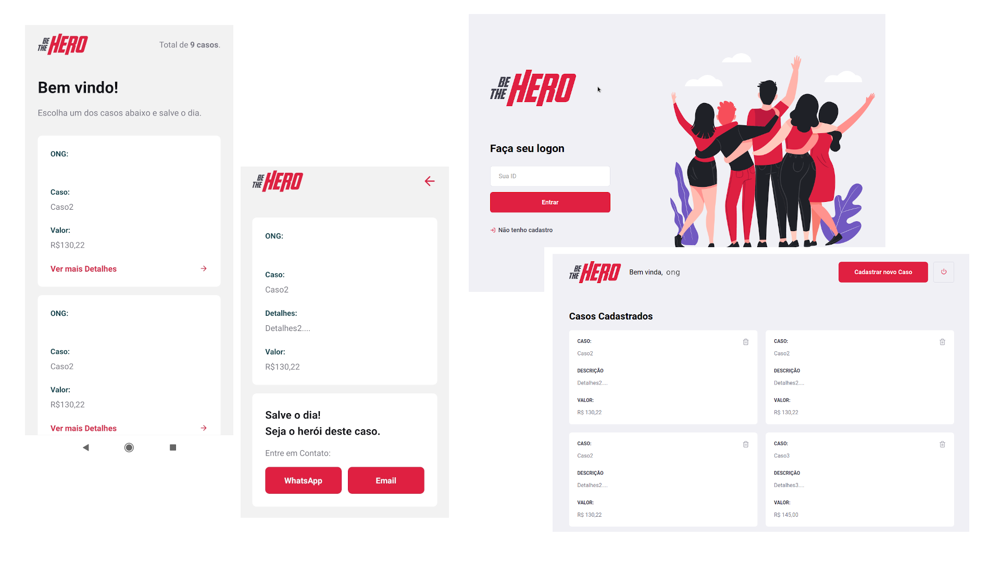

<h1 align="center">
    
</h1>

<h4 align="center">
  🚀 Semana OmniStack 11.0
</h4>

  

## :rocket: Tecnologias

Esse projeto foi desenvolvido com as seguintes tecnologias:

- [Node.js](https://nodejs.org/en/)
- [React](https://reactjs.org)
- [React Native](https://facebook.github.io/react-native/)
- [Expo](https://expo.io/)

## 💻 Projeto

"Be The Hero" é uma aplicação desenvolvida durante a Semana OmniStack 11.0, promovida pela [RocketSeat](https://rocketseat.com.br/). 

Este projeto é desenvolvido do começo ao fim, com aplicação BackEnd - que disponibiliza uma API REST - uma aplicação Web utilizando React - que é a interface das ONGS com o sistema, permitindo cadastrar ou excluir casos em aberto - e uma aplicação mobile utilizando React Native e Expo, em que o usuário pode escolher um caso em aberto e entrar em contato com a ONG responsável. 

--

